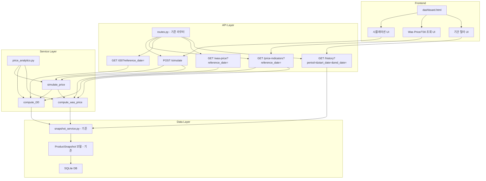

# 기술 설계 문서: Price Analytics

## 개요

Amazon Tracker MVP에 가격 분석 기능을 추가한다. 기존 `ProductSnapshot` 시계열 데이터를 활용하여 기간별 필터링, Was Price(90일 중앙값), T30(30일 최저값) 계산, 그리고 가격 시뮬레이션 기능을 제공한다.

핵심 설계 원칙:
- 기존 코드베이스(FastAPI + SQLAlchemy async + Jinja2)의 패턴을 그대로 따른다
- 새로운 서비스 모듈 `price_analytics.py`에 순수 계산 로직을 분리한다
- 기존 `routes.py`에 새 엔드포인트를 추가한다
- 기존 `dashboard.html`의 히스토리 다이얼로그를 확장한다

## 아키텍처



### 설계 결정 사항

1. **순수 함수 기반 계산 로직**: `compute_was_price(prices)`, `compute_t30(prices)`는 `list[float]`를 받아 결과를 반환하는 순수 함수로 구현한다. DB 조회와 계산을 분리하여 테스트 용이성을 확보한다.
2. **기존 히스토리 엔드포인트 확장**: 새로운 엔드포인트를 만들지 않고, 기존 `/history` 엔드포인트에 쿼리 파라미터를 추가하여 기간 필터링을 지원한다.
3. **시뮬레이션은 읽기 전용**: 시뮬레이션 시 실제 DB를 변경하지 않고, 메모리 내에서 가상 스냅샷을 주입하여 계산한다.

## 컴포넌트 및 인터페이스

### 1. 서비스 모듈: `app/services/price_analytics.py`

순수 계산 함수와 DB 연동 함수를 포함한다.

```python
# 순수 계산 함수 (DB 의존성 없음)
def compute_was_price(prices: list[float]) -> float | None:
    """가격 리스트의 중앙값을 계산한다. 빈 리스트이면 None 반환."""

def compute_t30(prices: list[float]) -> float | None:
    """가격 리스트의 최저값을 계산한다. 빈 리스트이면 None 반환."""

# DB 연동 함수
async def get_filtered_snapshots(
    session: AsyncSession,
    product_id: int,
    start_date: datetime | None = None,
    end_date: datetime | None = None,
) -> list[ProductSnapshot]:
    """기간 필터링된 스냅샷 목록을 반환한다."""

async def get_was_price(
    session: AsyncSession,
    product_id: int,
    reference_date: date,
) -> tuple[float | None, int]:
    """Was Price와 사용된 데이터 포인트 수를 반환한다."""

async def get_t30(
    session: AsyncSession,
    product_id: int,
    reference_date: date,
) -> tuple[float | None, int]:
    """T30과 사용된 데이터 포인트 수를 반환한다."""

async def simulate_price(
    session: AsyncSession,
    product_id: int,
    simulation_date: date,
    simulation_price: float,
    evaluation_date: date,
) -> SimulationResult:
    """시뮬레이션 전후의 Was Price, T30을 계산하여 반환한다."""
```

### 2. API 엔드포인트: `app/api/routes.py`에 추가

| 메서드 | 경로 | 설명 |
|--------|------|------|
| GET | `/api/v1/products/{marketplace}/{asin}/history` | 기존 엔드포인트에 `period`, `start_date`, `end_date` 쿼리 파라미터 추가 |
| GET | `/api/v1/products/{marketplace}/{asin}/was-price` | Was Price 조회 (`reference_date` 쿼리 파라미터) |
| GET | `/api/v1/products/{marketplace}/{asin}/t30` | T30 조회 (`reference_date` 쿼리 파라미터) |
| GET | `/api/v1/products/{marketplace}/{asin}/price-indicators` | Was Price + T30 통합 조회 |
| POST | `/api/v1/products/{marketplace}/{asin}/simulate` | 가격 시뮬레이션 |

### 3. 프론트엔드: `dashboard.html` 히스토리 다이얼로그 확장

기존 `<dialog id="history-dialog">` 내부에 세 가지 섹션을 추가한다:

- **기간 필터 바**: 프리셋 버튼(1d, 7d, 30d, 60d, 90d) + 커스텀 날짜 범위 입력
- **Was Price/T30 조회 패널**: 기준일 입력 + 조회 버튼 + 결과 표시 카드
- **시뮬레이션 패널**: 시뮬레이션 날짜/가격/평가일 입력 폼 + Before/After 비교 테이블

## 데이터 모델

### Pydantic 스키마 (`app/schemas/product.py`에 추가)

```python
from datetime import date, datetime
from pydantic import BaseModel, Field


class WasPriceResponse(BaseModel):
    """Was Price 조회 응답."""
    reference_date: date
    was_price: float | None
    data_points: int


class T30Response(BaseModel):
    """T30 조회 응답."""
    reference_date: date
    t30: float | None
    data_points: int


class PriceIndicatorsResponse(BaseModel):
    """Was Price + T30 통합 조회 응답."""
    reference_date: date
    was_price: float | None
    was_price_data_points: int
    t30: float | None
    t30_data_points: int


class SimulationRequest(BaseModel):
    """시뮬레이션 요청."""
    simulation_date: date
    simulation_price: float = Field(ge=0)
    evaluation_date: date


class SimulationResult(BaseModel):
    """시뮬레이션 결과."""
    evaluation_date: date
    before_was_price: float | None
    after_was_price: float | None
    before_t30: float | None
    after_t30: float | None
    simulation_date: date
    simulation_price: float
```

### DB 쿼리 패턴

기존 `ProductSnapshot` 모델을 그대로 사용한다. 기간 필터링은 `crawl_timestamp` 컬럼에 대한 WHERE 조건으로 구현한다.

```python
# Was Price: reference_date 기준 90일 윈도우
stmt = (
    select(ProductSnapshot.current_price)
    .where(
        ProductSnapshot.product_id == product_id,
        ProductSnapshot.crawl_timestamp >= reference_date - timedelta(days=90),
        ProductSnapshot.crawl_timestamp <= reference_date_end,
        ProductSnapshot.current_price.isnot(None),
    )
)

# T30: reference_date 기준 30일 윈도우
# 동일 패턴, timedelta(days=30) 사용
```

## 정합성 속성 (Correctness Properties)

*속성(Property)이란 시스템의 모든 유효한 실행에서 참이어야 하는 특성 또는 동작을 의미한다. 속성은 사람이 읽을 수 있는 명세와 기계가 검증할 수 있는 정합성 보장 사이의 다리 역할을 한다.*

### Property 1: 기간 필터링 정합성

*For any* 스냅샷 집합과 유효한 날짜 범위(start_date, end_date)에 대해, `get_filtered_snapshots`가 반환하는 모든 스냅샷의 `crawl_timestamp`는 [start_date, end_date] 범위 내에 있어야 하며, 결과는 `crawl_timestamp` 오름차순으로 정렬되어야 한다.

**Validates: Requirements 1.1, 1.2, 1.6**

### Property 2: 커스텀 범위 우선 적용

*For any* 기간 프리셋과 커스텀 날짜 범위가 동시에 주어졌을 때, 필터링 결과는 커스텀 날짜 범위만 적용한 결과와 동일해야 한다.

**Validates: Requirements 1.3**

### Property 3: Was Price는 statistics.median과 일치

*For any* 비어있지 않은 양수 가격 리스트에 대해, `compute_was_price(prices)`는 `statistics.median(prices)`와 동일한 값을 반환해야 한다.

**Validates: Requirements 9.1, 2.1, 2.3**

### Property 4: Was Price 순서 불변성

*For any* 가격 리스트와 그 리스트의 임의의 순열(permutation)에 대해, `compute_was_price`는 동일한 결과를 반환해야 한다.

**Validates: Requirements 9.2**

### Property 5: T30은 min()과 일치

*For any* 비어있지 않은 양수 가격 리스트에 대해, `compute_t30(prices)`는 `min(prices)`와 동일한 값을 반환해야 한다.

**Validates: Requirements 10.1, 3.1**

### Property 6: T30 순서 불변성

*For any* 가격 리스트와 그 리스트의 임의의 순열(permutation)에 대해, `compute_t30`은 동일한 결과를 반환해야 한다.

**Validates: Requirements 10.2**

### Property 7: T30 ≤ Was Price

*For any* 비어있지 않은 양수 가격 리스트에 대해, `compute_t30(prices)`의 결과는 `compute_was_price(prices)`의 결과 이하여야 한다.

**Validates: Requirements 10.3**

### Property 8: 시뮬레이션 정합성

*For any* 유효한 스냅샷 집합, simulation_date, simulation_price(≥0), evaluation_date(≥ simulation_date)에 대해, 시뮬레이션의 "before" 값은 원본 데이터로 독립 계산한 Was Price/T30과 일치해야 하고, "after" 값은 가상 가격이 추가된 데이터로 계산한 Was Price/T30과 일치해야 한다.

**Validates: Requirements 4.1, 4.2**

### Property 9: 시뮬레이션 유효성 검증

*For any* 음수 simulation_price 또는 simulation_date > evaluation_date인 입력에 대해, 시뮬레이션 API는 HTTP 400 오류를 반환해야 한다.

**Validates: Requirements 4.3, 4.4**

### Property 10: 시뮬레이션 DB 불변성

*For any* 시뮬레이션 실행 전후에 대해, 데이터베이스의 ProductSnapshot 레코드 수와 내용은 변경되지 않아야 한다.

**Validates: Requirements 4.5**

### Property 11: 통합 조회 일관성

*For any* 상품과 reference_date에 대해, `/price-indicators` 엔드포인트의 응답에 포함된 was_price와 t30 값은 각각 `/was-price`와 `/t30` 엔드포인트를 개별 호출한 결과와 동일해야 한다.

**Validates: Requirements 5.1, 5.2**

## 오류 처리

| 상황 | HTTP 상태 | 응답 |
|------|-----------|------|
| 존재하지 않는 상품 | 404 | `{"detail": "Product {marketplace}/{asin} not found."}` |
| simulation_price < 0 | 400 | `{"detail": "Simulation price must be non-negative."}` |
| simulation_date > evaluation_date | 400 | `{"detail": "Simulation date must be on or before evaluation date."}` |
| 유효한 가격 데이터 없음 | 200 | was_price/t30 필드에 `null` 반환 |
| 잘못된 날짜 형식 | 422 | Pydantic 자동 유효성 검증 오류 |

기존 패턴을 따라 `HTTPException`을 사용하며, 상품 존재 여부 확인은 기존 `product_service.get_product()`를 재사용한다.

## 테스트 전략

### 이중 테스트 접근법

단위 테스트와 속성 기반 테스트를 병행한다. 단위 테스트는 구체적인 예시와 엣지 케이스를, 속성 기반 테스트는 모든 입력에 대한 보편적 속성을 검증한다.

### 속성 기반 테스트 (Property-Based Testing)

- **라이브러리**: `hypothesis` (이미 `requirements.txt`에 포함)
- **최소 반복 횟수**: 각 속성 테스트당 100회 이상 (`@settings(max_examples=100)`)
- **태그 형식**: 각 테스트에 주석으로 설계 문서의 속성 번호를 참조
  - 예: `# Feature: price-analytics, Property 3: Was Price는 statistics.median과 일치`
- **각 정합성 속성은 하나의 속성 기반 테스트로 구현**한다

### 단위 테스트

- **프레임워크**: `pytest` + `pytest-asyncio`
- 구체적 예시: 알려진 가격 리스트에 대한 Was Price/T30 계산 결과 확인
- 엣지 케이스:
  - 빈 가격 리스트 → `None` 반환 (Req 2.4, 3.3)
  - null 가격이 포함된 스냅샷 필터링 (Req 2.2, 3.2)
  - 기간 내 스냅샷 없음 → 빈 배열 (Req 1.4)
- 오류 조건:
  - 존재하지 않는 상품 → 404 (Req 1.5, 2.5, 3.4, 4.6, 5.3)
  - 유효하지 않은 시뮬레이션 입력 → 400 (Req 4.3, 4.4)
- API 통합 테스트: `httpx.AsyncClient`로 엔드포인트 호출 검증

### 테스트 파일 구조

```
tests/
  test_price_analytics.py       # 순수 함수 단위 테스트 + 속성 기반 테스트
  test_price_analytics_api.py   # API 엔드포인트 통합 테스트
```
